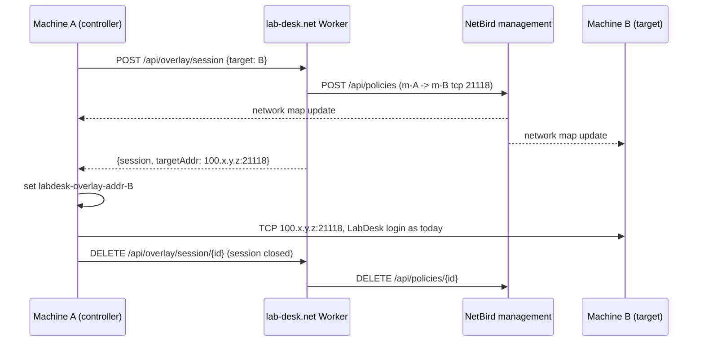
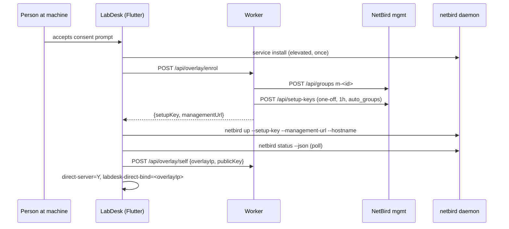

# feat: labnet, an encrypted direct path between LabDesk machines on NetBird

## Summary

LabDesk gains an optional encrypted overlay built on the NetBird client. Each machine that agrees is enrolled once into its own single-machine group on a NetBird management server LabDesk runs. Nothing can reach it there. A remote session then becomes a temporary one-way access rule between the controller's group and the target's group, created by lab-desk.net when the session starts and deleted when it ends; the management server pushes the rule to both peers at once, and LabDesk dials the target's overlay address directly instead of going through a rendezvous or relay server. A **labnet** is a persistent group a user creates and adds machines to; a machine joins only after a person approves the invitation on that machine. Inside a labnet, machines reach each other on LabDesk's ports and ping by default, or on every port when the labnet's full-access switch is on, which is what health monitoring, automation and site links use.

Product name on screen: **labnet**. NetBird's own names never appear.

---

## Problem Frame

- The rendezvous path depends on a server that any network in the middle can drop (today's case: an office guest Wi-Fi drops the RustDesk public server's address; ledger 2026-09-03). Two machines on two properties need a path that survives that.
- RustDesk sessions are end-to-end encrypted but the *reachability* is brokered by hbbs/hbbr; RMM traffic (health probes, terminal, automation) has no network of its own at all.
- The owner rejected an always-on mesh: "not ... at all times. Only when machines are connecting for remote access. Sustained ... only when users create labnet and add machines ... the machine being added must approve." Then proposed the shape adopted here: every machine in its own labnet, temporary cross-links for sessions.

**Alternative considered: a self-hosted hbbs/hbbr on the same Oracle VM.** It answers the incident (a network dropping the public server's address) with one server profile and no bundled daemon. It does not answer the rest of the order: sessions still route through that server whenever hole punching fails, RMM traffic still has no network of its own, labnets and site links do not exist. It remains available as a server profile on the same VM at any time and does not compete with this plan.

---

## Requirements

| ID | Requirement | Source |
|---|---|---|
| R1 | A machine is enrolled at most once, only after a person at that machine accepts one consent prompt, shown at sign-in or install. Enrolment is revocable from **This machine**. | owner, Q2 |
| R2 | An enrolled machine is reachable by nobody by default: its own group, no rules. | owner, mid-turn message 2 |
| R3 | Starting a remote session from machine A to machine B (same LabDesk account) creates a rule allowing A to reach B on TCP 21118 only, one way, and LabDesk connects over B's overlay address directly. Ending the session deletes the rule. If the overlay path is not up within 1.5 s the session falls through to the RustDesk transport unchanged. | owner, Q3 |
| R4 | A user creates labnets, names them, adds machines. An added machine shows the invitation and joins only on approval there. Members may leave; the owner may remove. | owner, mid-turn message 1 |
| R5 | Inside a labnet: TCP 21118 and ICMP between members by default; a per-labnet "full network access" switch allows all protocols and ports. | owner, Q3 |
| R6 | Control plane: NetBird management, signal and relay self-hosted by LabDesk on an Oracle free-tier Linux VM; the lab-desk.net Worker is the only thing that holds the management token. Clients never see it. | owner, Q1 |
| R7 | Windows and Linux in stage 1. macOS later. | owner, Q5 |
| R8 | The netbird daemon ships inside the LabDesk installer, pinned to v0.78.0, checksummed. No download at enrol time. | owner, Q7 |
| R9 | Site-to-site LAN advertisement is stage 3, after labnets work. | owner, Q6 |
| R10 | Server profiles are untouched. The overlay is a transport underneath, never a profile field. | design note, unchanged |

---

## Key Technical Decisions

1. **Ship the NetBird daemon, drive it with its own CLI from Dart.** `netbird up --setup-key`, `netbird down`, `netbird status --json`, `netbird service install`. Reason: the daemon's JSON socket on Windows is a named pipe, which Dart cannot open, and this machine has no Rust toolchain (Rust ships through CI), so the daemon talk lives in Flutter where it can be built and tested today. The JSON gateway stays the documented upgrade path for streaming status. `ponytail: polling status --json every 3 s while a screen needs it; SubscribeStatus over the socket when polling shows a cost.`
2. **One group per machine, named `m-<labdesk id>`, created by the Worker before the setup key.** The setup key is one-off, one use, `expires_in: 86400` (the documented minimum for `CreateSetupKeyRequest`; the key is spent within seconds), `auto_groups: [that group]`, so the peer lands in its group on registration and the group name is the mapping from LabDesk id to NetBird peer. The Worker records the NetBird peer id once the machine reports itself. A setup key keeps referencing its group for as long as it exists (`isGroupLinkedToSetupKey`, `management/server/group.go`), so revoking enrolment deletes the device's setup keys first, then the peer, then the group.
3. **A session is a NetBird policy, not a connection.** `POST /api/policies` with `name`, `enabled: true` and one rule (`name`, `enabled: true`, `action: accept`, sources `[m-A]`, destinations `[m-B]`, `protocol: tcp`, `ports: ["21118"]`, `bidirectional: false`); a policy without a name is refused and one without `enabled` is created inert (`policies_handler.go`). Deleted on session end. Verified in `management/server/policy.go`: `SavePolicy` reaches `ExpandAndUpdateAffected` and `dispatchAffected`, so both peers receive the new network map without waiting on any heartbeat. The peers still have to signal, run ICE and complete the WireGuard handshake after the rule lands, so the client waits for the target peer to read `Connected` in `netbird status --json` (cap 10 s) before dialling.
4. **The client keeps the peer id and gets an address hint, and the handshake still runs.** Flutter writes option `labdesk-overlay-addr-<id>` = `<overlay ip>:<direct port>` and `labdesk-overlay-pk-<id>` = the target's id public key before connecting; `Client::_start` in `src/client.rs` tries that address with a 1.5 s TCP timeout before the rendezvous path. The saved password, the peer record and every screen stay keyed by id. Connecting by bare IP was rejected: it forks the peer record and loses the remembered password. The stock `is_ip_str` branch returns no peer key and never calls `Client::secure_connection`, so a session on it runs without LabDesk's own end-to-end layer and `io_loop.rs` raises the insecure-connection prompt. The overlay branch therefore carries the target's id public key: the machine reports its own key (`Config::get_key_pair().1`) in `POST /api/overlay/self`, the session grant returns it, and the direct branch feeds it to the same key exchange the rendezvous path performs, with the signature check that `decode_id_pk` does against the rendezvous server key replaced by the fact that the key arrived over the device-authenticated HTTPS channel from lab-desk.net. Verification: the session reports secured, no prompt.
5. **The direct listener binds to the overlay address only.** `direct_server` in `src/rendezvous_mediator.rs` listens on any address today. Enrolment sets `direct-server=Y` and a new option `labdesk-direct-bind=<overlay ip>`; the loop binds to that address when set. The `whitelist` option was rejected for this: `check_whitelist` in `src/server/connection.rs` applies to every incoming connection, so a CIDR there would block ordinary rendezvous sessions.
6. **Invitations and session grants travel through lab-desk.net, polled by Dart with the device's existing token** (`access_token` local option, the same bearer `client-api.ts` already checks). 15 s cadence, matching the Rust heartbeat. No Rust change and no new push channel for stage 1. Session grants do not need the poll: the management server pushes the rule.
7. **Labnet policy = one policy per labnet**, group `ln-<labnet id>`, rules within the group: tcp 21118 and icmp, or `protocol: all` when full access is on. Membership change = `PUT /api/groups/{id}` with the new peer list.
8. **The NetBird account's default all-to-all policy is deleted on server setup.** A fresh account carries a policy that allows every peer to reach every peer (`newAccountWithId(..., disableDefaultPolicy)` in `management/server/account.go`); R2 is false until it is gone. The setup runbook deletes it and the Worker refuses to serve enrolments while `GET /api/policies` still lists a policy whose sources include the `All` group.
9. **Management URL `https://nb.lab-desk.net`, DNS-only (grey cloud).** gRPC over HTTP/2 and UDP 3478 STUN do not go through Cloudflare's proxy. The Worker reaches the API over HTTPS like any client.
10. **Peer approval is not available self-hosted** (verified cloud-only in the research note). Consent is enforced where it can be: enrolment only runs on the machine itself after the prompt, and labnet membership only changes on that machine's decision, which the Worker records before it touches the group.

---

## High-Level Technical Design

Enrolment:

States the daemon reports and what the screen says: `Idle`/`NeedsLogin` = not enrolled; `Connecting` = connecting; `Connected` = ready; `LoginFailed`/`SessionExpired` = the daemon's error, plus "Enrol again".

---

## Scope Boundaries

**In:** R1 to R8, R10, Windows and Linux, the server runbook, the Worker broker, the Flutter screens and services, the two Rust changes, installer packaging, docs.

**Out (deferred to follow-up work):**
- Stage 3: site-to-site LAN advertisement (NetBird networks, routers, masquerade), R9.
- Cross-account access (a target that grants a *different* LabDesk account a session). Stage 1 is same-account only.
- Silent enrolment for unattended installs (an installer flag that pre-accepts consent). Owner decision needed; default is the prompt.
- JSON-socket streaming status. CLI polling first.
- macOS.
- Exit-node selection on the overlay. Not a LabDesk need.

**Outside this product's identity:** replacing RustDesk's transport. The rendezvous path stays the fallback and the path for machines that never enrol.

---

## Implementation Units

### U1. NetBird server on the Oracle VM, and the Worker's credentials

**Goal:** A reachable management server at `https://nb.lab-desk.net` with local users, the default policy removed, and a service-user token stored as Worker secrets.
**Requirements:** R6, R2.
**Dependencies:** the owner's VM (blocked until Oracle sign-up completes; `mgmtsrvr@lab-desk.net` exists as of 2026-09-03, forwarding to trapadmin@proton.me).
**Files:** `docs/LABNET-SERVER.md` (runbook), `../labdesk-site/wrangler.jsonc` (no change; secrets are runtime), `../labdesk-site/README.md` (secret names).
**Approach:** `getting-started.sh` from the v0.78.0 release with the bundled Traefik; TCP 80/443 and UDP 3478 open on the VM's security list; DNS A record `nb.lab-desk.net`, proxied off. First admin created at `/setup`; a service user with a personal access token; `DELETE /api/policies/{default}`. Secrets `NETBIRD_API_URL`, `NETBIRD_TOKEN` set with `wrangler secret put`. Never on a command line in a transcript.
**Test scenarios:** `Test expectation: none -- infrastructure; verification below.`
**Verification:** from this workstation, `GET https://nb.lab-desk.net/api/peers` with the token answers 200 and `[]`; `GET /api/policies` answers `[]`; `netbird status --json` on a throwaway enrolment shows `management.connected: true` and `signal.connected: true`.

### U2. Worker: NetBird API client

**Goal:** One module that speaks to the management API, with the calls U4 and U5 need and nothing else.
**Requirements:** R2, R3, R4, R5.
**Dependencies:** none (tests run against a fake fetch).
**Files:** `../labdesk-site/src/worker/netbird.ts`, `../labdesk-site/test/netbird.test.ts`.
**Approach:** functions `createGroup(name, peers)`, `setGroupPeers(id, name, peers)`, `deleteGroup(id)`, `findPeerByGroup(groupId)`, `deletePeer(id)`, `createSetupKey(name, groupId)` (one-off, `expires_in: 86400`, `usage_limit: 1`, `ephemeral: false`), `listSetupKeys()`, `deleteSetupKey(id)`, `createPolicy(name, rules)`, `deletePolicy(id)`, `listPolicies()`; `Authorization: Token <PAT>` from env; every non-2xx becomes an error carrying NetBird's message. `Execution note: test-first; the request bodies are the contract.`
**Patterns to follow:** `../labdesk-site/src/worker/mail.ts` (a thin fetch client with env-held secret).
**Test scenarios:** setup-key body carries exactly `{name, type: "one-off", expires_in: 3600, auto_groups: [id], usage_limit: 1, ephemeral: false}`; policy body for a session carries one rule with `bidirectional: false`, `protocol: "tcp"`, `ports: ["21118"]`; labnet policy with full access carries `protocol: "all"` and no ports; a 403 from NetBird becomes an error whose message includes NetBird's `message`; the token never appears in a thrown error.
**Verification:** vitest green for the module.

### U3. Worker: schema for enrolment, sessions, labnets

**Goal:** The tables the broker needs, migrated.
**Requirements:** R1 to R5.
**Dependencies:** none.
**Files:** `../labdesk-site/src/worker/db/schema.ts`, new file under `../labdesk-site/drizzle/`.
**Approach:** `overlay_device(device_id pk, user_id, group_id, overlay_ip, public_key, enrolled_at, revoked_at)`; `labnet(id pk, user_id, name, full_access int, group_id, policy_id, created_at)`; `labnet_member(labnet_id, device_id, status: pending|approved|left|removed, invited_by, invited_at, decided_at, pk(labnet_id, device_id))`; `overlay_session(id pk, controller_device_id, target_device_id, policy_id, started_at, ended_at)`.
**Test scenarios:** `Test expectation: none -- schema; U4 tests exercise it.`
**Verification:** `drizzle-kit generate` produces one migration; `wrangler d1 migrations apply --local` succeeds; existing tests still green.

### U4. Worker: the overlay routes

**Goal:** Device-authenticated endpoints for enrolment, self-report, sessions, labnets, invitations and the inbox.
**Requirements:** R1 to R5, R10.
**Dependencies:** U2, U3, U5.
**Files:** `../labdesk-site/src/worker/routes/overlay.ts`, `../labdesk-site/src/worker/index.ts` (mount), `../labdesk-site/test/overlay.test.ts`.
**Approach:** every route uses `bearerUser` from `client-api.ts` (device token, so the caller is a known device of a known user). Routes:
- `POST /api/overlay/enrol` creates `m-<deviceId>` and a setup key; refuses when a policy on the `All` group exists (KTD 8); records `overlay_device`.
- `POST /api/overlay/self` stores `overlayIp`, the NetBird `publicKey`, the LabDesk id public key `idPk`, and the effective direct port `directPort` (default 21118; `get_direct_port()` honours `direct-access-port`), and looks up and stores the NetBird peer id for the device's group. The client re-posts it whenever the daemon comes up with a different address.
- `DELETE /api/overlay/enrol` marks revoked, then in this order: deletes every setup key whose `auto_groups` names the device's group, deletes the peer, deletes the group.
- **Machine identity.** A device id is client-declared at sign-in (`/api/login` stores whatever `id` and `uuid` the client sends), so the Worker binds enrolment to the pair: `overlay_device` records the token's `deviceUuid` at enrol; enrol is refused when the id already belongs to another account; `self`, `session` and `decide` are refused when the calling token's `deviceUuid` differs from the enrolled one.
- `POST /api/overlay/session {target}` requires both devices enrolled under the same user, creates the policy on the target's `directPort`, records the session, returns `{id, targetAddr, targetIdPk}`; `DELETE /api/overlay/session/:id` deletes the policy. Sessions older than 12 h are swept (policy deleted, `endedAt` set) by the session handler and by `GET /api/overlay/inbox`, which every enrolled machine polls every 15 s, so a dead controller cannot leave a rule standing (no cron).
- `GET/POST /api/overlay/labnets`, `PATCH /api/overlay/labnets/:id {name, fullAccess}` (owner only; recomposes the policy), `DELETE` (owner only).
- `POST /api/overlay/labnets/:id/invite {deviceId}` (owner only; the device must be enrolled under the same account) creates a pending member; `POST /api/overlay/invites/:labnetId/decide {approve}` is accepted only from the invited device's own token with the enrolled `deviceUuid`; approve puts the peer in the group.
- `POST /api/overlay/labnets/:id/leave`, `DELETE /api/overlay/labnets/:id/members/:deviceId` (owner).
- `GET /api/overlay/inbox` returns this device's pending invitations and its labnets with member state.
**Execution note:** test-first with the fake NetBird client; every refusal path has a test before the handler.
**Patterns to follow:** `../labdesk-site/src/worker/routes/client-api.ts` (bearer auth, `smallJson`, rate limit helper).
**Test scenarios:** enrol twice returns the same group and a fresh key; enrol with the default policy present answers 503 with a plain sentence; enrol of a device id another account holds answers 403; revoke deletes setup keys before the peer before the group; a call carrying a different `deviceUuid` than the enrolled one answers 403; session between devices of two different users answers 403; session to an unenrolled target answers 409; decide from a device other than the invitee answers 403; PATCH or invite from a non-owner answers 403; approve moves the member to `approved` and calls `setGroupPeers` with the full approved list; leave calls `setGroupPeers` without the leaver; full-access toggle deletes the old policy and creates one with `protocol: all`; inbox for a device with one pending invite lists it with the labnet name and inviter.
**Verification:** vitest green; `wrangler dev` answers the enrol route with a device token from a local sign-in.

### U5. Worker: labnet policy composition

**Goal:** The single function that turns a labnet row into its NetBird policy rules.
**Requirements:** R5.
**Dependencies:** U2.
**Files:** `../labdesk-site/src/worker/labnet-policy.ts`, `../labdesk-site/test/labnet-policy.test.ts`.
**Approach:** pure function `(labnet, groupId) -> rules[]`; default: `[tcp 21118 bidirectional, icmp bidirectional]`; full access: `[all bidirectional]`.
**Test scenarios:** default gives two rules with the group as both source and destination; full access gives one rule; names carry the labnet name so the dashboard reads.
**Verification:** vitest green.

### U6. Flutter: the daemon service and its state

**Goal:** The only file that knows NetBird exists, and a pure state model.
**Requirements:** R1, R3.
**Dependencies:** none.
**Files:** `flutter/lib/labdesk/services/overlay_daemon.dart`, `flutter/lib/labdesk/models/overlay_state.dart`, `flutter/test/labdesk_overlay_daemon_test.dart`, `flutter/test/labdesk_overlay_state_test.dart`.
**Approach:** `OverlayDaemon` takes a `ProcessRunner` (injectable) and the binary path; `status()` parses `netbird status --json` into `OverlayState` (`daemonStatus`, `netbirdIp`, `publicKey`, `management.connected`, `signal.connected`, peers with `fqdn`, `netbirdIp`, `status`, `connectionType`, `latency`); `up(setupKey, managementUrl, hostname)`, `down()`, `installService(...)` builds the elevated command line (`--daemon-addr`, `--management-url`, `--disable-update-settings`, `NB_STATE_DIR` in `--service-env`). Binary path: `<exe dir>/netbird/netbird.exe` on Windows, `/usr/lib/labdesk/netbird/netbird` on Linux. Never `--allow-server-ssh`.
**Execution note:** test-first against captured JSON; capture real `status --json` from a live daemon in U13's verification and add it as a fixture.
**Patterns to follow:** `flutter/lib/labdesk/services/probe_reader.dart` (parsing a foreign process's output into a model).
**Test scenarios:** each of the six `daemonStatus` values maps to the right enum; a peer with `connectionType: "P2P"` renders Direct and `"Relayed"` renders Relayed; malformed JSON gives `OverlayState.unknown`, never a throw; `up` passes the setup key as an argument and never an env var (NB_ env vars beat flags); the service-install command carries every required flag exactly once.
**Verification:** flutter test green.

### U7. Flutter: the broker client and inbox poll

**Goal:** Dart-only access to the overlay routes with the device's token, and a 15 s inbox poll while the console runs.
**Requirements:** R1, R3, R4.
**Dependencies:** U4 (contract), none for tests.
**Files:** `flutter/lib/labdesk/services/overlay_broker.dart`, `flutter/test/labdesk_overlay_broker_test.dart`.
**Approach:** `OverlayBroker(httpClient, baseUrl, tokenReader)`; methods mirror U4; the poller is a `Stream<Inbox>` driven by a `Timer.periodic` the caller owns.
**Test scenarios:** a 401 stops the poll and surfaces "Sign in again"; `session()` returns the target address; `endSession()` is fire-and-forget and swallows network errors; the token comes from the reader on every call, not captured once.
**Verification:** flutter test green.

### U8. Flutter: consent, enrolment and This machine

**Goal:** The one prompt, the enrol flow, the state on **This machine**.
**Requirements:** R1, R2.
**Dependencies:** U6, U7.
**Files:** `flutter/lib/labdesk/screens/this_machine_screen.dart`, `flutter/lib/labdesk/console_page.dart` (wires daemon, broker and options), `flutter/test/labdesk_this_machine_overlay_test.dart`.
**Approach:** card "Encrypted direct connections": Off / Enrolling / On (overlay address) / Error. Consent prompt appears once per machine when signed in and not enrolled, remembered in local option `labdesk-overlay-consent` (`asked`). Enrol = install service if `status()` reports no daemon, `enrol()`, `up()`, poll to `Connected`, `self()`, then set `direct-server=Y` and `labdesk-direct-bind`. Disable = `down()`, `DELETE enrol`, clear the two options.
**Test scenarios:** prompt shown once and never again after decline; enrol sequence order (install before enrol before up before self); a daemon that never reaches Connected within 60 s shows the daemon's `management.error` text; disable clears `labdesk-direct-bind` and sets `direct-server` back to `N` (otherwise the listener falls back to every interface).
**Verification:** flutter test green; a screenshot of the card in each state from the design harness (`lib/labdesk_preview.dart`).

### U9. Flutter: the Network section (labnets)

**Goal:** Create labnets, add machines, approve or decline on the invited machine, see members and their overlay state.
**Requirements:** R4, R5, R10.
**Dependencies:** U7, U8.
**Files:** `flutter/lib/labdesk/screens/console_shell.dart` (section `network`, label "Network"), `flutter/lib/labdesk/screens/network_screen.dart`, `flutter/lib/labdesk/console_page.dart`, `flutter/test/labdesk_network_screen_test.dart`, `flutter/test/labdesk_console_shell_test.dart` (section count and Ctrl+N reach).
**Approach:** presentational screen taking `Inbox` and handing back intents. Top: pending invitations for this machine ("<user> wants to add this machine to <labnet>": Approve, Decline). Then labnets: name, full-access switch, members with a dot (Connected / Offline / Pending), Add machine (picks from the address book), Leave / Remove. Wording: labnet, Approve, Decline, Direct, Relayed. No em or en dashes.
**Test scenarios:** an invitation renders its two actions and nothing else until decided; the full-access switch is only shown to the labnet's owner; a member pending approval shows "Waiting for approval on that machine"; the section is reachable by keyboard like the others.
**Verification:** flutter test green; screenshot from the design harness; `flutter analyze` adds no issue in LabDesk files against the pinned 3.24.5.

### U10. Flutter: session grant on connect

**Goal:** Before a session to an enrolled machine starts, obtain the grant and hand the client the address hint; on session end, release it.
**Requirements:** R3.
**Dependencies:** U7.
**Files:** `flutter/lib/labdesk/console_page.dart` (the connect entry the console uses), `flutter/lib/labdesk/services/overlay_session.dart`, `flutter/test/labdesk_overlay_session_test.dart`.
**Approach:** `OverlaySession.prepare(id)` asks the broker; on a grant it polls `OverlayDaemon.status()` until the target peer reads `Connected` (cap 10 s, the rule has to be signalled and the WireGuard handshake completed first), then writes `labdesk-overlay-addr-<id>` via `bind.mainSetOption`; on any failure or on the cap it writes nothing and connects as today. The observed grant-to-Connected time is recorded in U11's field check. The session registry the console already keeps (2 s window poll, `get_remote_list`) notices the session disappear and calls `endSession()`, then clears the option. `ponytail: end detection rides the existing registry; a Rust-side close hook if the 2 s lag ever matters.`
**Test scenarios:** broker failure yields a connect with no hint and no error shown; grant yields the option set to `ip:21118`; end clears the option and releases exactly once.
**Verification:** flutter test green.

### U11. Rust: address hint in the client

**Goal:** `Client::_start` uses the overlay address when it answers, else the rendezvous path unchanged.
**Requirements:** R3.
**Dependencies:** U10 (option name).
**Files:** `src/client.rs` (`_start`, before `get_rendezvous_server`).
**Approach:** read `Config::get_option("labdesk-overlay-addr-<id>")`; if set, `connect_tcp_local(addr, None, 1500)`; on Ok return the direct tuple exactly as the `is_ip_str` branch does; on Err log at info and continue. Nothing else changes.
**Test scenarios:** `Test expectation: none locally -- no Rust toolchain on this workstation; CI builds. Field check below.`
**Verification:** CI green; with two enrolled machines, the client log shows the direct branch and no `rendezvous server:` line for that session; with the hint pointing at a dead address the session still opens through the rendezvous path within the usual time plus 1.5 s.

### U12. Rust: direct listener bound to the overlay address

**Goal:** The direct-IP listener serves the overlay interface only.
**Requirements:** R2, R3.
**Dependencies:** U8 (option name).
**Files:** `src/rendezvous_mediator.rs` (`direct_server`), `libs/hbb_common/src/config.rs` if the option needs a key constant (prefer a string literal in the one call site).
**Approach:** when `labdesk-direct-bind` is set, bind `SocketAddr(ip, port)` instead of `listen_any`; the loop already rebinds when the port changes; extend that check to the bind address.
**Test scenarios:** `Test expectation: none locally -- CI builds. Field check below.`
**Verification:** on an enrolled Windows machine `netstat -ano | findstr 21118` shows the listener on the overlay address only; a connection from the LAN to `<lan ip>:21118` is refused; from an authorised labnet peer it is accepted.

### U13. Installer and CI: bundle netbird v0.78.0

**Goal:** `netbird.exe` and `wintun.dll` under `C:\Program Files\LabDesk\netbird\`, the Linux binary under `/usr/lib/labdesk/netbird/`, checksummed at build time, third-party notices updated.
**Requirements:** R7, R8.
**Dependencies:** none.
**Files:** `build.py`, `.github/workflows/flutter-build.yml`, `res/` or a new `third_party/netbird/` manifest with pinned asset names and SHA-256 from the v0.78.0 release, `docs/THIRD-PARTY.md` (new) or the existing notices file, `install.ps1`, `install.sh`.
**Approach:** CI downloads `netbird_0.78.0_windows_amd64.tar.gz` and `netbird_0.78.0_linux_amd64.tar.gz` from the GitHub release, verifies against the pinned checksums, copies `netbird.exe` and `wintun.dll` (Windows tar carries both; `client/netbird.wxs` line 30 is the upstream proof wintun ships beside the exe) into the package. No `netbird-ui`. Notices gain NetBird's BSD-3 and wintun's Prebuilt Binaries License.
**Test scenarios:** `Test expectation: none -- packaging; verification below.`
**Verification:** the built Windows installer, installed on a clean VM, leaves `netbird.exe --version` printing `0.78.0`; the deb lists the two files; sizes match the pinned assets.

### U14. Documentation and the vault

**Goal:** What ships is written down where the next session looks.
**Requirements:** all.
**Dependencies:** U1 to U13.
**Files:** `docs/CONSOLE.md` (Network section, This machine card), `docs/WORKFLOW.md` (gate inventory row if any beta-only behaviour), `CHANGELOG.md`, `~/trapLab-brain/30_Projects/LabDesk/network-tool-design.md` (revised), `development-log.md`, `lab-desk-net.md` (secrets, mailbox, `nb.lab-desk.net`).
**Test scenarios:** `Test expectation: none -- docs.`
**Verification:** each doc names the option keys and routes exactly as the code spells them.

---

## Verification Contract

- Worker: `npm test` in `labdesk-site` green, including new suites; `wrangler dev` answers `/api/overlay/inbox` for a signed-in device.
- Flutter: `flutter test test/labdesk_*.dart` green; `flutter analyze --no-fatal-infos` adds no issue in LabDesk files against the pinned 3.24.5 (`docs/WORKFLOW.md`).
- Rust: CI build green on the feature branch; field checks in U11 and U12 recorded in the ledger with log lines.
- End to end: two enrolled machines on two networks; a session from one to the other logs the direct branch; `netbird status --json` on the target shows the controller peer `Connected` for the session and gone after; `GET /api/policies` on the management server is empty between sessions.
- Screens looked at, not only tested: This machine card states and the Network section, from the design harness, before the PR.

## Definition of Done

R1 to R8 and R10 demonstrated end to end on Foundry (Windows) and homebox (Linux) with the ledger carrying the evidence; PR open against `labdesk-next` from a branch off `feat/lab-desk-net`, gates green locally first, no AI attribution in commits or PR body; vault notes revised.

---

## Risks and Dependencies

- **The VM does not exist yet.** U1 blocks the end-to-end proof, not the code. Everything else is testable against fakes and `wrangler dev`.
- **Windows named pipe under LabDesk's service account.** The Flutter process runs as the signed-in user; `netbird status` from that user reaches `\\.\pipe\netbird` when the daemon is not elevated. Unknown until tried (research note, open question). Mitigation: the CLI is what NetBird's own tray uses, so the CLI path is the supported one.
- **Oracle free tier UDP 3478.** Oracle's default security list drops UDP; the runbook opens it. Without it peers relay instead of going direct, which still works.
- **NetBird account limits self-hosted:** none.
- **Prebuilt wintun licence** allows redistribution alongside software that uses it via the permitted API, which is NetBird's case. Notices required.
- **A stale session policy** if the client dies before `DELETE`. Mitigated by the 12 h sweep in U4 and the fact that a policy alone grants no LabDesk login.

## Open Questions (deferred, not blocking)

- Silent enrolment for unattended installs (an installer switch that pre-accepts consent on a machine nobody sits at). Default: not offered in stage 1.
- Whether Foundry's Proxmox network passes UDP for the WireGuard port at all; if not, its sessions relay through the VM's relay service.

## Sources and Research

- `~/trapLab-brain/30_Projects/LabDesk/research-netbird-integration.md` (cited, 2026-09-03).
- NetBird v0.78.0 source, cloned at `~/TrapLab/netbird` and indexed in codebase-memory: `client/proto/daemon.proto`, `client/cmd/service_json_gateway.go`, `shared/management/http/api/openapi.yml` (`CreateSetupKeyRequest`, `PolicyRuleMinimum`, `GroupRequest`), `management/server/policy.go`, `management/server/account.go`, `client/netbird.wxs`.
- LabDesk source: `src/client.rs` (`_start`, `LoginConfigHandler`), `src/rendezvous_mediator.rs` (`direct_server`, `get_direct_port`), `src/server/connection.rs` (`check_whitelist`), `src/hbbs_http/sync.rs` (15 s heartbeat), `flutter/lib/common.dart` (`connect`), `docs/CONSOLE.md`, `docs/WORKFLOW.md`.
- lab-desk.net Worker: `src/worker/routes/client-api.ts`, `src/worker/db/schema.ts`.
- Cloudflare: zone `87502ce7e31f8cb00ec93ca0739c11a1`, Email Routing enabled 2026-09-03, rule `mgmtsrvr@lab-desk.net` to trapadmin@proton.me, status `ready`.
